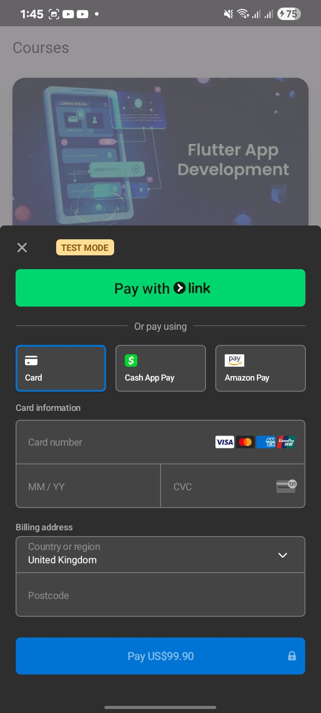

# 📚 Course Selling App  

A modern Flutter project with a clean and responsive UI for browsing and purchasing online courses.  
Integrated with **Stripe Payment Gateway** for secure and seamless checkout.  

---

## 📱 Screenshots  

### 🏠 Home Screen  

  
  

  

---

## 🚀 Features  

✅ Modern Flutter UI for Course Marketplace  
✅ Browse and View Course Details  
✅ Stripe Payment Integration 💳  
✅ User Authentication (optional)  
✅ Dark Mode Support  
✅ Responsive Layout for Mobile  

---

## 🛠️ Getting Started  

This project is a starting point for a **Flutter Course Selling Application**.  

- [Lab: Write your first Flutter app](https://docs.flutter.dev/get-started/codelab)  
- [Cookbook: Useful Flutter samples](https://docs.flutter.dev/cookbook)  

For more help, view the [official Flutter documentation](https://docs.flutter.dev/).  

---

## 🤝 Contributing  

Contributions are welcome!  
If you’d like to fix a bug or suggest a feature, feel free to **open an issue** or **submit a pull request**.  

---

## ⭐ Show your support  

If you like this project, **give it a star ⭐** on GitHub — it helps others discover it too!
